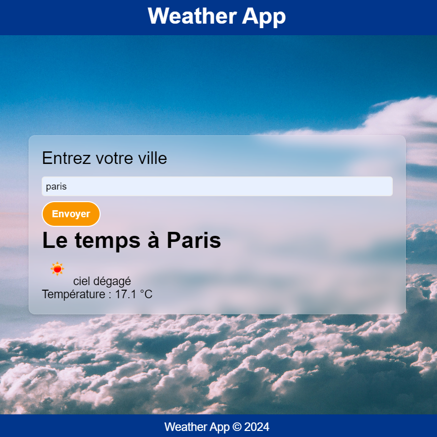

# Application Météo

Ce projet est une application météo simple qui permet aux utilisateurs de saisir le nom d'une ville et d'obtenir les informations météorologiques actuelles pour cette localisation en utilisant l'API OpenWeatherMap.

## Table des Matières
- [Fonctionnalités](#fonctionnalités)
- [Technologies](#technologies)
- [Installation](#installation)
- [Utilisation](#utilisation)
- [Configuration de la Clé API](#configuration-de-la-clé-api)
- [Captures d'Écran](#captures-décran)
- [Contribution](#contribution)
- [Licence](#licence)

## Fonctionnalités
- Interface pour saisir les noms de villes.
- Affiche la météo actuelle, y compris la température et la description de la météo.
- Utilise l'API OpenWeatherMap pour récupérer les données météorologiques.
- Design réactif avec un effet de glassmorphism.

## Technologies
- HTML
- CSS
- JavaScript (Vanilla)
- API OpenWeatherMap

## Installation
1. Clonez le dépôt :
    ```bash
    git clone https://github.com/RobinBIDOT/weatherAPI.git
    cd weather-app
    ```

2. Ouvrez le répertoire du projet dans votre éditeur de code préféré.

## Utilisation
1. Ouvrez `index.html` dans votre navigateur pour démarrer l'application.

2. Saisissez le nom de la ville pour laquelle vous souhaitez obtenir des informations météorologiques et cliquez sur le bouton "Envoyer".

## Configuration de la Clé API
Pour utiliser cette application, vous devez configurer votre clé API OpenWeatherMap.

1. Obtenez votre clé API depuis [OpenWeatherMap](https://home.openweathermap.org/users/sign_up).

2. Ouvrez `js/weather.js` et trouvez la ligne suivante :
    ```javascript
    let apiKey = ""; 
    ```

3. Remplacez la chaîne vide par votre clé API :
    ```javascript
    let apiKey = "VOTRE_CLÉ_API_ICI"; 
    ```

4. Sauvegardez les modifications.

## Captures d'Écran
### Interface Principale


## Contribution
1. Forkez le dépôt.
2. Créez une nouvelle branche (`git checkout -b feature-branch`).
3. Apportez vos modifications.
4. Commitez vos modifications (`git commit -m 'Ajouter une nouvelle fonctionnalité'`).
5. Poussez vers la branche (`git push origin feature-branch`).
6. Créez une nouvelle Pull Request.

## Licence
Ce projet est sous licence MIT.
